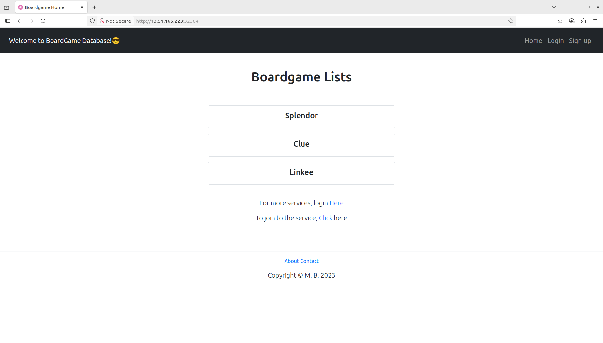
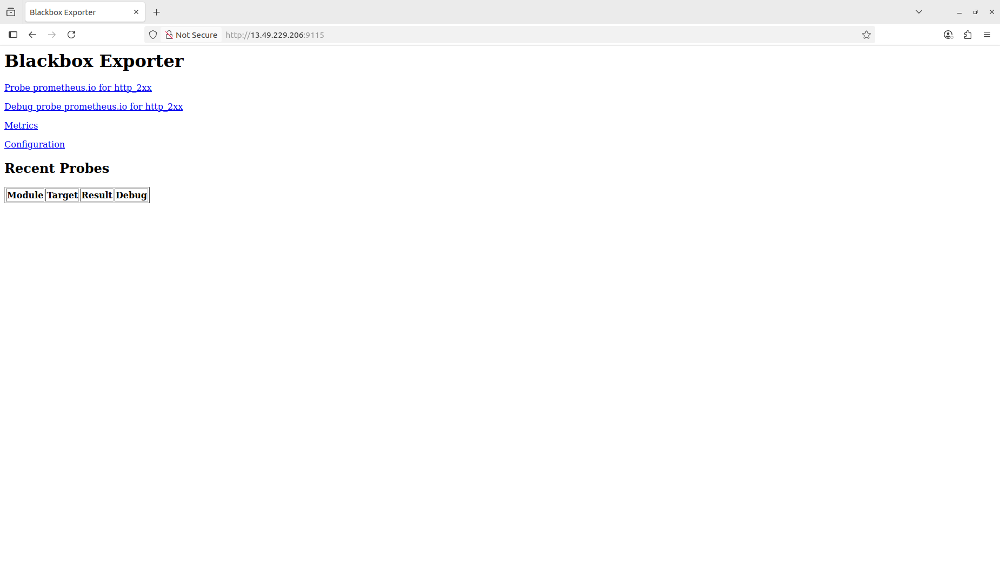

# **🚀 BroadGame DevOps Pipeline project**

## **Initial setup and Deployment**

### **Phase 1:Create Security group(game)**

- Create a security group .Allow ports
    - SMTP 25
    - CUSTOM TCP 3000 - 10000
    - HTTP 80
    - HTTPS 443
    - SSH 22
    - CUSTOM TCP 6443
    - SMTPS 465
    - CUSTOM TCP 30000-32676


### **Phase 2:Launch EC2 (ubuntu 22.04) for Kubernetes**
- Create 3 EC2 instance on AWS with Ubuntu 22.04, t3.large, storage= 30gb.
- Attach the Security group with instance.(game) 
- Connect it using SSH.
- Change the hostname one as Master other as Slave-1 and Slave-2

**Connecting (All nodes)**

- Step 1: Update and Upgrade Ubuntu **(all nodes)**
```bash
sudo apt update && sudo apt upgrade -y
```

- Step 2: Disable Swap **(all nodes)**
```bash
sudo swapoff -a
sudo sed -i '/ swap / s/^\(.*\)$/#\1/g' /etc/fstab
```

- Step 3: Add Kernel Parameters **(all nodes)**

```bash
sudo tee /etc/modules-load.d/containerd.conf <<EOF
overlay
br_netfilter
EOF
sudo modprobe overlay
sudo modprobe br_netfilter
```
- Step 4:Configure the critical kernel parameters for Kubernetes using the following:

```bash
sudo tee /etc/sysctl.d/kubernetes.conf <<EOF
net.bridge.bridge-nf-call-ip6tables = 1
net.bridge.bridge-nf-call-iptables = 1
net.ipv4.ip_forward = 1
EOF
```

- Step 5: Reload the change 

```bash
sudo sysctl --system
```

- Step 6: Install Containerd Runtime **(all nodes)**

```bash
sudo apt install -y curl gnupg2 software-properties-common apt-transport-https ca-certificates
```

```bash
sudo curl -fsSL https://download.docker.com/linux/ubuntu/gpg | sudo gpg --dearmour -o /etc/apt/trusted.gpg.d/docker.gpg
sudo add-apt-repository "deb [arch=amd64] https://download.docker.com/linux/ubuntu $(lsb_release -cs) stable"
```

```bash
sudo apt update
sudo apt install -y containerd.io
```

```bash
containerd config default | sudo tee /etc/containerd/config.toml >/dev/null 2>&1
sudo sed -i 's/SystemdCgroup \= false/SystemdCgroup \= true/g' /etc/containerd/config.toml
```

```bash
sudo systemctl restart containerd
sudo systemctl enable containerd
```

- Step 7: Add Apt Repository for Kubernetes **(all nodes)**

```bash
echo "deb [signed-by=/etc/apt/keyrings/kubernetes-apt-keyring.gpg] https://pkgs.k8s.io/core:/stable:/v1.30/deb/ /" | sudo tee /etc/apt/sources.list.d/kubernetes.list
curl -fsSL https://pkgs.k8s.io/core:/stable:/v1.30/deb/Release.key | sudo gpg --dearmor -o /etc/apt/keyrings/kubernetes-apt-keyring.gpg
```
- Step 8: Install Kubectl, Kubeadm, and Kubelet **(all nodes)**

```bash
sudo apt update
sudo apt install -y kubelet kubeadm kubectl
sudo apt-mark hold kubelet kubeadm kubectl
```

- Step 7: Initialize Kubernetes Cluster with Kubeadm **(master node)**

```bash
sudo kubeadm init
```

- Step 8: Run the following commands on the **(master node)**

```bash
mkdir -p $HOME/.kube
sudo cp -i /etc/kubernetes/admin.conf $HOME/.kube/config
sudo chown $(id -u):$(id -g) $HOME/.kube/config
```
one by one

```bash
kubectl get nodes
```

**In between if  some error occured type this command (All Nodes)**

```bash
sudo modprobe br_netfilter
echo 1 | sudo tee /proc/sys/net/bridge/bridge-nf-call-iptables
echo 1 | sudo tee /proc/sys/net/ipv4/ip_forward
```

- Step 9: Add Worker Nodes to the Cluster **(worker nodes)**

```bash
kubeadm join 138.197.184.45:6443 --token 72ww2b.6orffywqcf5s4p2z \
        --discovery-token-ca-cert-hash sha256:aafb79cdd45a6e3b3fac01fb3efba0817360b01f90a4b6c3f11567108a36ba67
```

**Replace it with your key that you have got on last of `sudo kubeadm init` command on masternode**


- Step 10: Install Kubernetes Network Plugin **(master node)**

```bash
kubectl apply -f https://raw.githubusercontent.com/projectcalico/calico/v3.25.0/manifests/calico.yaml
```


```bash
kubectl get pods -n kube-system
kubectl get nodes
```

The output should be 1 Masternode and 2 workernode both Status should be **ready**


### **Phase 3: Launch EC2 (ubuntu 22.04) for Sonarqube**

- Create an EC2 instance on AWS with Ubuntu 22.04, t3.medium, storage= 30gb.
- Attach the Security group with instance. (game) 
- Connect it using SSH.
- Change the hostname to sonar

**Step 1: Install Docker**

```bash
vi docker.sh
```
Paste it below

```bash
# Add Docker's official GPG key:
sudo apt-get update
sudo apt-get install ca-certificates curl
sudo install -m 0755 -d /etc/apt/keyrings
sudo curl -fsSL https://download.docker.com/linux/ubuntu/gpg -o /etc/apt/keyrings/docker.asc
sudo chmod a+r /etc/apt/keyrings/docker.asc

# Add the repository to Apt sources:
echo \
  "deb [arch=$(dpkg --print-architecture) signed-by=/etc/apt/keyrings/docker.asc] https://download.docker.com/linux/ubuntu \
  $(. /etc/os-release && echo "${UBUNTU_CODENAME:-$VERSION_CODENAME}") stable" | \
  sudo tee /etc/apt/sources.list.d/docker.list > /dev/null
sudo apt-get update
```

```bash
sudo apt-get install docker-ce docker-ce-cli containerd.io docker-buildx-plugin docker-compose-plugin
```


```bash
sudo chmod +x docker.sh
sh docker.sh
```
Acess it using 

`publicIp:9000`

**Step 2: Install Sonarqube using docker**

```bash
docker run -d --name sonar -p 9000:9000 sonarqube:lts-community
```

```bash
docker ps
docker images
```


### **Phase 4: Launch EC2 (ubuntu 22.04) for Nexus Repository**

- Create an EC2 instance on AWS with Ubuntu 22.04, t3.medium, storage= 30gb.
- Attach the Security group with instance. (game) 
- Connect it using SSH.
- Change the hostname to nexus

**Step 1: Install Docker**

```bash
vi docker.sh
```
Paste it below

```bash
# Add Docker's official GPG key:
sudo apt-get update
sudo apt-get install ca-certificates curl
sudo install -m 0755 -d /etc/apt/keyrings
sudo curl -fsSL https://download.docker.com/linux/ubuntu/gpg -o /etc/apt/keyrings/docker.asc
sudo chmod a+r /etc/apt/keyrings/docker.asc

# Add the repository to Apt sources:
echo \
  "deb [arch=$(dpkg --print-architecture) signed-by=/etc/apt/keyrings/docker.asc] https://download.docker.com/linux/ubuntu \
  $(. /etc/os-release && echo "${UBUNTU_CODENAME:-$VERSION_CODENAME}") stable" | \
  sudo tee /etc/apt/sources.list.d/docker.list > /dev/null
sudo apt-get update
```


```bash
sudo apt-get install docker-ce docker-ce-cli containerd.io docker-buildx-plugin docker-compose-plugin
```

```bash
sudo chmod +x docker.sh
sh docker.sh
```


**Step 2: Install Nexus using Docker**

```bash
docker run -d --name nexus -p 8081:8081 sonatype/nexus3
```

```bash
docker ps
docker images
```

Acess it using 

`publicIp:8081`


Default username is admin 

To get password. Go inside the container

```bash
docker exec -it <container-id> /bin/bash
```
Relace it with your container id

```bash
ls
```

```bash
cd sonatype-work
```

```bash
ls
```

```bash
cd nexus3
```

```bash
ls
```

```bash
cat admin.password
```

It will generate a password copy till bash

eg:**(c53ce18a-2a58-4026-8da0-4d00602df100dbash-4.4$)**   you will get like this copy till   **(c53ce18a-2a58-4026-8da0-4d00602df100d)**

Copy password and paste it on the nexus repository.

Change password.

Enable anonymous access

And exit from container

```bash
exit
```


### **Phase 5: Launch EC2 (ubuntu 22.04) for Jenkins**

- Create an EC2 instance on AWS with Ubuntu 22.04, t3.medium, storage= 30gb.
- Attach the Security group with instance. (game) 
- Connect it using SSH.
- Change the hostname to nexus

**Step 1: Update the package**

```bash
sudo apt-get update
```


**Step 2: Install Jenkins**

**Installing Jenkins**


```bash
sudo wget -O /etc/apt/keyrings/jenkins-keyring.asc \
  https://pkg.jenkins.io/debian-stable/jenkins.io-2023.key
echo "deb [signed-by=/etc/apt/keyrings/jenkins-keyring.asc]" \
  https://pkg.jenkins.io/debian-stable binary/ | sudo tee \
  /etc/apt/sources.list.d/jenkins.list > /dev/null
sudo apt-get update
sudo apt-get install jenkins
```

**Installing Java**


```bash
sudo apt update
sudo apt install fontconfig openjdk-21-jre
java -version
```

**Start Jenkins**

```bash
sudo systemctl enable jenkins
```

```bash
sudo systemctl start jenkins
```

```bash
sudo systemctl status jenkins
```


Acces it with port number 8080

`<public-ip:8080>`


Setup Jenkins


**Step 2: Install Docker**

```bash
vi docker.sh
```
Inside this

```bash
# Add Docker's official GPG key:
sudo apt-get update
sudo apt-get install ca-certificates curl
sudo install -m 0755 -d /etc/apt/keyrings
sudo curl -fsSL https://download.docker.com/linux/ubuntu/gpg -o /etc/apt/keyrings/docker.asc
sudo chmod a+r /etc/apt/keyrings/docker.asc

# Add the repository to Apt sources:
echo \
  "deb [arch=$(dpkg --print-architecture) signed-by=/etc/apt/keyrings/docker.asc] https://download.docker.com/linux/ubuntu \
  $(. /etc/os-release && echo "${UBUNTU_CODENAME:-$VERSION_CODENAME}") stable" | \
  sudo tee /etc/apt/sources.list.d/docker.list > /dev/null
sudo apt-get update
```


```bash
sudo apt-get install docker-ce docker-ce-cli containerd.io docker-buildx-plugin docker-compose-plugin
```

```bash
sudo chmod +x docker.sh
sh docker.sh
```
```bash
sudo usermod -aG docker $USER
newgrp docker
sudo chmod 666 /var/run/docker.sock
```

Login into docker hub on browser 

Login docker in terminal using

```bash
docker login -u didin8080
```

It asks for a password provide dockerhub password

**Install Trivy**

```bash
vi trivy.sh
```

Paste it below.

```bash
sudo apt-get install wget apt-transport-https gnupg
wget -qO - https://aquasecurity.github.io/trivy-repo/deb/public.key | gpg --dearmor | sudo tee /usr/share/keyrings/trivy.gpg > /dev/null
echo "deb [signed-by=/usr/share/keyrings/trivy.gpg] https://aquasecurity.github.io/trivy-repo/deb generic main" | sudo tee -a /etc/apt/sources.list.d/trivy.list
sudo apt-get update
sudo apt-get install trivy
```

```bash
sudo chmod +x trivy.sh
./trivy.sh
```

**Install Kubectl**

```bash
vi kubectl.sh
```

paste it inside

```bash
curl -o kubectl https://amazon-eks.s3.us-west-2.amazonaws.com/1.19.6/2021-01-05/bin/linux/amd64/kubectl
chmod +x ./kubectl
sudo mv ./kubectl /usr/local/bin
kubectl version --short --client
```

```bash
sudo chmod +x kubectl.sh
sh kubectl.sh
```


### **Phase 6: Clone the repository**

```bash
git clone https://github.com/didin8080/boardgame.git
```

### **Phase 7: Configure on Jenkins**

**Step 1: Install necessary plugins on Jenkins**

Goto Jenkins dashboard--> Manage Jenkins --> Plugins

Install below plugins
- Eclipse temurim installer
- sonarqube scanner
- Maven integration
- Config File Provider
- Pipeline Maven integration
- docker 1.6.2
- docker pipeline
- docker-build-step
- Kubernetes 
- Kubernetes CLI
- Kubernetes Credentials
- Kubernetes client API
- pipeline:stage view
- email extension template


**Step 2: Tools configuration in jenkins**

Goto Jenkins dashboard--> Manage Jenkins --> tools 
- add jdk,give name as jdk17 ,install automatically ,add installer, install from adoptium.net, select jdk-17.0.8.1+1 
- add sonarqube scanner--> name= sonar-scaner,insall automatically,
- add maven --> name= maven ,install automaticaly,version=3.6.1
- add docker --> name=docker,install automatically,add installer ,download from docker.com

**Step 3: ADD Credentials on Jenkins**

- On sonarqube -> admininstration-->security--> user--> rightside 3dots--> give any name --> generate token
- On jenkins --> manage jenkins-->credentials-->global--> add credentials--> kind=secret text --> on secret paste the token and give any name and description-->give any id and description-->create
- On jenkins --> manage jenkins-->credentials-->global--> add credentials-->kind=username with password--> username=give the username of dockerhub--> password=password of dockerhub-->create
- On jenkins --> manage jenkins-->credentials-->global--> add credentials--> kind=username with password--> username=give github username --> password= the toke that you created on github.
- On jenkins --> manage jenkins-->credentials-->global--> add credentials--> kind=username with password--> username= provide your mail id -->password= the APP PASSWORD that you created --> id smtp.
- On jenkins --> manage jenkins-->credentials-->global--> add credentials--> kind=secret text --> on secret paste the api token that created on master node for kubernetes --> id= k8s 


**Step 4: Create webhook in sonarqube**

- on jenkins--> manage jenkins--> system--> add sonarqube server -->give name as sonar-server--> on server url= paste the url of sonarqube with sonarqube-webhook eg:**(192.168.20.173:8080/sonarqube-webhook)** -->select the authentication --> apply and save .

**Step 5: System Configuration in Jenkins**

On jenkins--> manage jenkins--> system

- add sonarqube server -->give name as sonar-server--> on server url= paste the url of sonarqube -->select the authentication --> apply and save .
- Extended email notification --> On SMTP server= smtp.gmail.com --> SMTP port = 465 -->advanced --> enale use SSL --> on credentails = add credentials that we added for gmail
- E-mail Notification --> On SMTP server = smtp.gmail.com --> advanced --> enable use ssl --> smtp port 465--> enable use SMTP authentication --> username= didinpg8080@gmail.com --> on password = app password `eg:(drsn anne afrd pcfx)`--> enable test configuration by sending email --> enter our email--> test configuration --> Goto your email you will get an test email from jenkins --> apply and save


**Step 6: Configure Project on Sonarqube**

On Sonarqube--> Create project -->give projet name and key name --> and create
--> select locally --> generate a token --> continue --> other --> Linux --> copy the command and paste it on the sonarqube analysis portion on jenkins pipeline

**Step 7: on nexus repository**

- Goto nexus repository --> browsers --> copy the url of `maven-release`
- Goto github --> pom.xml --> edit that file --> on last --> Replace maven-release with new url
- Goto nexus repository --> browsers --> copy the url of `maven-snapshots`
- Goto github --> pom.xml --> edit that file --> on last --> Replace maven-snapshots with new url

**Step 8: Add Config file on Jenkins**

on jenkins--> manage jenkins--> Manages files --> Add a new config --> enable global maven settings.xml -->scrool down --> ID = global-settings -->      On Content -->scrool till mid you will see `<server>` --> on server    
`(-->)`remove from back and paste it on front .

eg: \
`<server>` \
`<id>deploymentid</id>` \
`<username>repouser</username>` \
`<password>repopwd</password>` \
`</server>` \
`-->`


it will be like this edit like this

`-->` \
`<server>` \
`<id>meven-release</id>` \
`<username>admin</username>`  # nexus repo username  
`<password>admin123</password>` # nexus repo password \
`</server>` 

`<server>` \
`<id>meven-snapshots</id>` \
`<username>admin</username>`  # nexus repo username  
`<password>admin123</password>` # nexus repo password \
`</server>` 


### Goto  masternode terminal

Create service.yml 

```bash
vi svc.yaml
```

paste it below

```bash
apiVersion: v1
kind: ServiceAccount
metadata: 
  name: jenkins
  namespace: webapps
```

Create namespace

```bash
kubectl create ns webapps
```

```bash
kubectl apply -f svc.yaml
```


Create role.yml

```bash
vi role.yaml
```

paste it below

```bash
apiVersion: rbac.authorization.k8s.io/v1
kind: Role
metadata:
  name: app-role
  namespace: webapps
rules:
  - apiGroups:
        - ""
        - apps
        - autoscaling
        - batch
        - extensions
        - policy
        - rbac.authorization.k8s.io
    resources:
      - pods
      - secrets
      - componentstatuses
      - configmaps
      - daemonsets
      - deployments
      - events
      - endpoints
      - horizontalpodautoscalers
      - ingress
      - jobs
      - limitranges
      - namespaces
      - nodes
      - pods
      - persistentvolumes
      - persistentvolumeclaims
      - resourcequotas
      - replicasets
      - replicationcontrollers
      - serviceaccounts
      - services
    verbs: ["get", "list", "watch", "create", "update", "patch", "delete"]
```

```bash
kubectl apply -f role.yaml
```

Create bind.yaml

```bash
vi bind.yaml
```
paste it below

```bash
apiVersion: rbac.authorization.k8s.io/v1
kind: RoleBinding
metadata:
  name: app-rolebinding
  namespace: webapps 
roleRef:
  apiGroup: rbac.authorization.k8s.io
  kind: Role
  name: app-role 
subjects:
- namespace: webapps 
  kind: ServiceAccount
  name: jenkins 
```

```bash
kubectl apply -f bind.yaml
```

create a API token

```bash
vi sec.yaml
```
paste it below


```bash
apiVersion: v1
kind: Secret
type: kubernetes.io/service-account-token
metadata:
  name: mysecretname
  annotations:
    kubernetes.io/service-account.name: jenkins
```

```bash
kubectl apply -f sec.yaml -n webapps
```

```bash
ls
```

```bash
kubectl describe secret mysecretname -n webapps
```
Now you will get the token. Copy the token and add it on jenkins credentials.


**Step 9: Configure CI/CD pipeline in jenkins**

Before pasting the pipeline script, do the following changes in the script
1. In the stage 'Tag and Push to DockerHub', give your docker-hub username. Similar thing you should do in 'Deploy to kubernetes' stages
2. In post actions stage in pipeline, make sure to give the email id you have configured in jenkins.
3. Replace the checout repo and generate the link using Pipeline Syntax
4. while generating the github link will will be in private.To get the link add credentials on the link 

```groovy
pipeline {
    agent any
    tools {
        jdk 'jdk17'
        maven 'maven'
    }
    stages {
        stage('Clean Workspace') {
            steps {
                cleanWs()
            }
        }
        stage('Git Checkout') {
            steps {
                git branch: 'main', credentialsId: 'github', url: 'https://github.com/didin2003/boardGame.git'
            }
        }
        stage('Compile') {
            steps {
                sh 'mvn compile'
            }
        }
        stage('Test') {
            steps {
                sh 'mvn test'
            }
        }
        stage('File System Scan') {
            steps {
                sh 'trivy fs --format table -o trivy-fs-report.html .'
            }
        }
        stage('SonarQube Analysis') {
           steps {
              withCredentials([string(credentialsId: 'sonar-token', variable: 'SONAR_TOKEN')]) {
                  script{
                      def scannerHome = tool 'sonar-scanner'
                  sh """
                     ${tool 'sonar-scanner'}/bin/sonar-scanner \
                     -Dsonar.projectKey=game \
                     -Dsonar.sources=. \
                     -Dsonar.host.url=http://51.21.222.109:9000 \
                     -Dsonar.login=$SONAR_TOKEN
                     """
                   }
                }
             }
        }
        stage('Build') {
            steps {
                sh 'mvn package'
            }
        }
        stage('Publish to Nexus') {
            steps {
                withMaven(globalMavenSettingsConfig: 'global-settings', jdk: 'jdk17', maven: 'maven', traceability: true) {
                    sh 'mvn deploy'
                }
            }
        }
        stage('Build and Tag Docker Image') {
            steps {
                script {
                    withDockerRegistry(credentialsId: 'docker') {
                        sh 'docker build -t didin8080/boardshack:latest .'
                    }
                }
            }
        }
        stage('Docker Image Scan') {
            steps {
                sh 'trivy image --format table -o trivy-image-report.html didin8080/boardshack:latest'
            }
        }
        stage('Push Docker Image') {
            steps {
                script {
                    withDockerRegistry(credentialsId: 'docker') {
                        sh 'docker push didin8080/boardshack:latest'
                    }
                }
            }
        }
        stage('Deploy to Kubernetes') {
            steps {
                withKubeConfig(
                    caCertificate: '',
                    clusterName: 'kubernetes',
                    contextName: '',
                    credentialsId: 'k8-cred',
                    namespace: 'webapps',
                    restrictKubeConfigAccess: false,
                    serverUrl: 'https://172.31.29.47:6443'
                ) {
                    sh 'kubectl apply -f deployment-service.yaml'
                }
            }
        }
        stage('Verify the Deployment') {
            steps {
                withKubeConfig(
                    caCertificate: '',
                    clusterName: 'kubernetes',
                    contextName: '',
                    credentialsId: 'k8-cred',
                    namespace: 'webapps',
                    restrictKubeConfigAccess: false,
                    serverUrl: 'https://172.31.29.47:6443'
                ) {
                    sh 'kubectl get pods -n webapps'
                    sh 'kubectl get svc -n webapps'
                }
            }
        }
    }
    post {
        always {
            emailext(
                attachLog: true,
                subject: "'${currentBuild.result}'",
                body: """
                    <html>
                    <body>
                        <div style="background-color: #FFA07A; padding: 10px; margin-bottom: 10px;">
                            <p style="color: white; font-weight: bold;">Project: ${env.JOB_NAME}</p>
                        </div>
                        <div style="background-color: #90EE90; padding: 10px; margin-bottom: 10px;">
                            <p style="color: white; font-weight: bold;">Build Number: ${env.BUILD_NUMBER}</p>
                        </div>
                        <div style="background-color: #87CEEB; padding: 10px; margin-bottom: 10px;">
                            <p style="color: white; font-weight: bold;">URL: ${env.BUILD_URL}</p>
                        </div>
                    </body>
                    </html>
                """,
                to: 'didinpg8080@gmail.com',
                replyTo: 'didinpg8080@gmail.com',
                mimeType: 'text/html',
                attachmentsPattern: 'trivy-image-report.html'
            )
        }
    }
}
```

### Build it


Your application is deployed in kubernetes to access it.

Goto console output --> scroll down -->  you will get an port number under `kubectl get svc -n webapps`

Copy the ip adress of Slave-1 instance(workernode) and paste it in new tab with port number `eg(32304)` you will get some different port.

`<public-ip:32304>`

<div align="center">

<p align="center"> Home page </p>
</div>


## **Phase 8: Moniter the Application**

- Create an EC2 instance on AWS with Ubuntu 22.04, t3.medium, storage= 30gb.
- Attach the Security group with instance. (game) 
- Connect it using SSH.
- Change the hostname to moniter


**Step 1: Install Promethesus** 

```bash
sudo apt-get update
```

Goto google type download and install prometheus

copy the linux os link on prometheus

```bash 
wget https://github.com/prometheus/prometheus/releases/download/v3.5.0-rc.0/prometheus-3.5.0-rc.0.linux-amd64.tar.gz
```

```bash
ls
```

```bash
tar -xvf prometheus-3.5.0-rc.0.linux-amd64.tar.gz
```

```bash
rm -rf prometheus-3.5.0-rc.0.linux-amd64.tar.gz
```

```bash
cd prometheus-3.5.0-rc.0.linux-amd64
```

```bash
ls
```

```bash
./proetheus & #(&)-it will run in background
```

Access it with `<public-ip:9090>`


Control + C to get back from this


**step 2: Install Grafana**

```bash
cd ..
```

```bash
sudo apt-get install -y adduser libfontconfig1 musl
wget https://dl.grafana.com/enterprise/release/grafana-enterprise_12.0.2_amd64.deb
sudo dpkg -i grafana-enterprise_12.0.2_amd64.deb
```

```bash
sudo  /bin/systemctl daemon-reload
sudo /bin/systemctl enable grafana-server
sudo /bin/systemctl start grafana-server
```

Access it with `<public-ip:3000>`

**step 3: Install Blackbox_exporter**


Goto google type download and install prometheus

copy the linux os link on Blackbox_exporter


```bash
wget https://github.com/prometheus/blackbox_exporter/releases/download/v0.27.0/blackbox_exporter-0.27.0.linux-amd64.tar.gz
```

``` bash
tar -xvf blackbox_exporter-0.27.0.linux-amd64.tar.gz
```

```bash
ls
```

```bash
rm -rf blackbox_exporter-0.27.0.linux-amd64.tar.gz
```

```bash
cd blackbox_exporter-0.27.0.linux-amd64
```

```bash
ls
```

```bash
./blackbox_exporter &
``` 

Access it with `<public-ip:9115>`

<div align="center">

<p align="center"> Blackbox Page </p>
</div>


**step 4: connect blackbox to prometheus**

```bash
cd ..
```

```bash
ls
cd prometheus-3.5.0-rc.0.linux-amd64
```

```bash
ls
ci prometheus.yml
```

 **You will see the content and also there is a default job called "Prometheus" Paste the below content at the end of the file;**

```yaml
- job_name: 'node_exporter'
    static_configs:
      - targets: ['<MonitoringVMip>:9100']

  - job_name: 'jenkins'
    metrics_path: '/prometheus'
    static_configs:
      - targets: ['<your-jenkins-ip>:<your-jenkins-port>']
- job_name: 'blackbox'
  metrics_path: /probe
  params:
    module: [http_2xx]
  static_configs:
    - targets:
      - http://prometheus.i0
      - http://13.51.165.223:32304
  relabel_configs:
    - source_labels: [__address__]
        target_label: __param_target
    - source_labels: [__param_target]
```

```bash
prep prometheus  #run this command you will get a PID number kill it
``` 
```bash
kill (PIDnumber)
```

Restart prometheus


```bash
./prometheus &
``` 

**Step 7: Add Prometheus Data Source:**

To visualize metrics, you need to add a data source. Follow these steps:

- Click on the gear icon (⚙️) in the left sidebar to open the "Configuration" menu.

- Select "Data Sources."

- Click on the "Add data source" button.

- Choose "Prometheus" as the data source type.

- In the "HTTP" section:
  - Set the "URL" to `http://localhost:9090` (assuming Prometheus is running on the same server).
  - Click the "Save & Test" button to ensure the data source is working.

**Step 8: Import a Dashboard:**
 
To make it easier to view metrics, you can import a pre-configured dashboard. Follow these steps:

- Click on the "+" (plus) icon in the left sidebar to open the "Create" menu.

- Select "Dashboard."

- Click on the "Import" dashboard option.

- Enter the dashboard code you want to import (e.g., code 1860).

- Click the "Load" button.

- Select the data source you added (Prometheus) from the dropdown.

- Click on the "Import" button.

You should now have a Grafana dashboard set up to visualize metrics from Prometheus.

Grafana is a powerful tool for creating visualizations and dashboards, and you can further customize it to suit your specific monitoring needs.

That's it! You've successfully installed and set up Grafana to work with Prometheus for monitoring and visualization.
